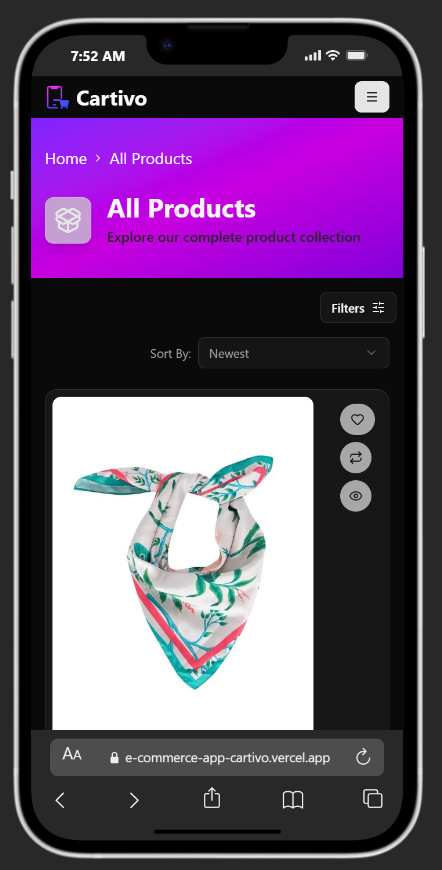

# 🛍️ Cartivo – Smart Online Shopping Experience


> Cartivo is a modern full-featured e-commerce web application built using the latest Next.js ecosystem.  
> It delivers a smart shopping experience with authentication, cart & wishlist management, multi-language support, and a fully responsive UI.

🌐 **Live Demo:**  
https://e-commerce-app-cartivo.vercel.app/

---

## ✨ Overview

Cartivo is a production-ready e-commerce platform built with:

- ⚡ Next.js 16 (App Router)
- 🔐 Secure Authentication (NextAuth)
- 🌍 Multi-language Support (Arabic & English)
- 🛒 Cart & Wishlist System
- 📦 Checkout & Shipping Flow
- 🎨 Fully Responsive UI (Mobile / Tablet / Desktop)
- 🌙 Dark / Light Mode

---

## 🖼️ Screenshots

### 💻 Desktop


### 📱 Mobile



### 📟 Tablet


---

## 🚀 Tech Stack

### ⚙️ Core

- Next.js 16
- React 19
- TypeScript

### 🎨 UI & Styling

- Tailwind CSS
- Radix UI
- class-variance-authority
- clsx
- tailwind-merge
- Framer Motion
- Lucide React
- Sonner (Toast Notifications)

### 🧠 Forms & Validation

- React Hook Form
- Zod
- @hookform/resolvers

### 🔐 Authentication

- NextAuth.js
- JWT Decode

### 🌍 Internationalization

- next-intl (RTL & LTR Support)

### 🌙 Theme Support

- next-themes

### 🎠 UI Enhancements

- Embla Carousel

---

## 🔐 Authentication System

- Secure Login & Registration
- JWT-based session handling
- Protected Routes
- Production-ready environment configuration
- Secure token handling in Server Actions

---

## 🛒 Features

### 👤 User Account

- Register / Login
- Update Profile Information
- Change Password
- Manage Delivery Addresses

### 🛍️ Shopping

- Browse Products
- Add to Cart
- Add to Wishlist
- Remove Items
- Update Cart Quantity
- Checkout Process

### 💳 Payment Options

- Cash on Delivery
- Online Payment (Test Mode)

### 🌍 Internationalization

- Arabic (RTL)
- English (LTR)
- Dynamic Locale Routing

---

## 📁 Project Structure

```bash
E-COMMERCE
│
├── public/
├── screenShoots/
├── src/
│   ├── actions/
│   ├── app/
│   │   └── [locale]/
│   │       ├── (auth)/
│   │       ├── (pages)/
│   │       ├── [...catchAll]/
│   │       ├── layout.tsx
│   │       ├── page.tsx
│   │       └── not-found.tsx
│   ├── components/
│   ├── hooks/
│   ├── i18n/
│   ├── lib/
│   ├── messages/
│   ├── providers/
│   ├── services/
│   └── types/
│
├── proxy.ts
├── next.config.ts
└── README.md
```

---

## 🔧 Environment Variables

Create a `.env.local` file:

```env
NEXT_PUBLIC_BASE_URL=your_api_url
NEXTAUTH_SECRET=your_secret_key
NEXTAUTH_URL=http://localhost:3000
```

For production (Vercel), configure these variables in Project Settings.

---

## 🖥️ Installation

```bash
git clone https://github.com/your-username/cartivo.git
cd cartivo
npm install
npm run dev
```

Production build:

```bash
npm run build
npm start
```

---

## 🌟 Key Highlights

- Built using the latest Next.js App Router architecture
- Clean and scalable folder structure
- Production-ready deployment on Vercel
- Secure authentication handling
- Real-world cart & checkout flow
- RTL & LTR full support
- Modern UI with smooth animations

---

## 🚀 Deployment

Deployed on **Vercel** with full production configuration:

https://e-commerce-app-cartivo.vercel.app/

---

## 👩‍💻 Author

Dana Mahmoud Mohamed  
Frontend Developer | React & Next.js Developer

---

## 📌 Future Improvements

- Stripe Production Integration
- Admin Dashboard
- Product Filtering & Search Optimization
- Order History System
- Performance Optimization (Caching & ISR)

---

⭐ If you like this project, feel free to give it a star!
